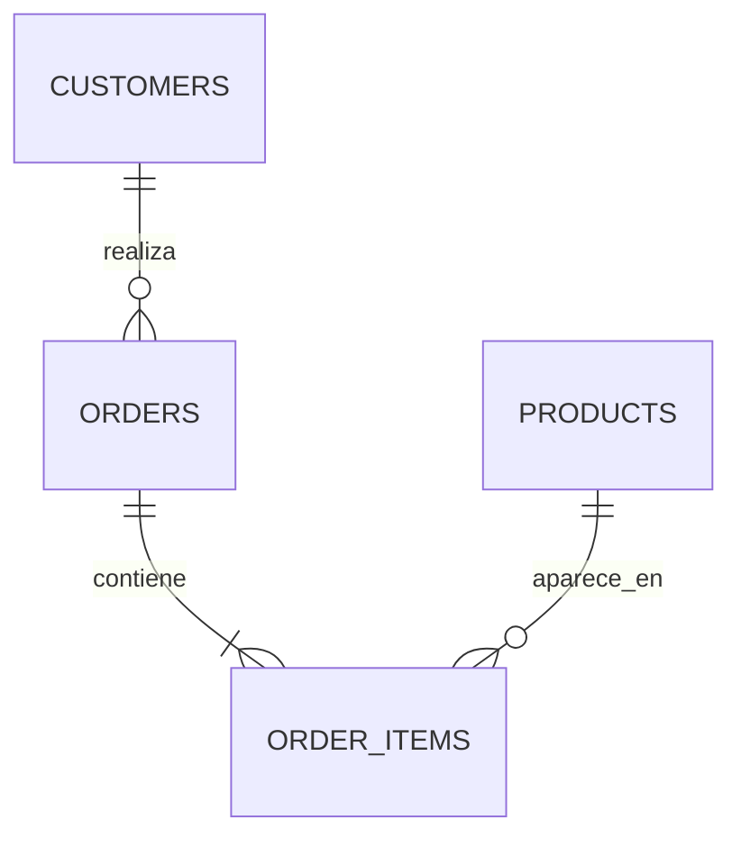

# DER - E&G Shop

## Explicación

- **Llaves primarias**
  - `customers.id`
  - `orders.id`
  - `products.id`
  - `order_items.id`
- **Llaves foráneas**
  - `orders.customer_id -> customers.id`
  - `order_items.order_id -> orders.id`
  - `order_items.product_id -> products.id`
- **Cardinalidades**
  - Un cliente puede realizar muchos pedidos (`1:N`).
  - Un pedido contiene uno o muchos renglones de detalle (`1:N`).
  - Un producto puede aparecer en muchos detalles (`1:N`).
- **Propósito de tablas**
  - `products`: catálogo y control de inventario.
  - `customers`: datos de contacto del comprador.
  - `orders`: cabecera del pedido y su estado.
  - `order_items`: detalle de productos comprados por pedido.
